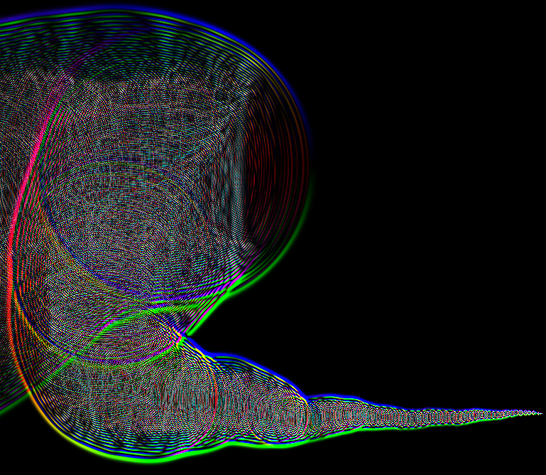

# Colorsound
Shader representing sort of sound waves in color. 
This is a re-implementation of my [shadertoy](https://www.shadertoy.com/view/wlc3R2),
in python + openGL

## Installation
`pip install -r requirements.txt`, then execute `colorsound.py`
>  If troubles in Linux, `sudo apt install python3-pygame`

## Usage
Just over the window with your mouse !